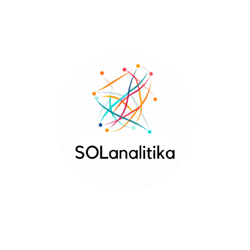

# SOLanalitika 🌐



SOLanalitika is a comprehensive analytics platform aimed at providing insightful and user-friendly analytics solutions for the Solana blockchain network. It offers features like Blockchain Explorer, Portfolio Tracking, Advanced Analytics, and DeFi Analytics, making it a one-stop solution for all Solana analytics needs. It is created within the hyperdrive hackathon competition.

## Table of Contents 📚
1. [Features](#features)
2. [Installation](#installation)
3. [Usage](#usage)
4. [Contributing](#contributing)
5. [License](#license)

## Features 🌟
### Blockchain Explorer 🌐
Explore and analyze Solana transactions, addresses, and blocks with our intuitive and detailed blockchain explorer.

### Portfolio Tracking 📈
Monitor your Solana holdings and performance over time with our advanced portfolio tracking feature.

### Advanced Analytics 📊
Gain insights into network health, consensus algorithms, and token economics with our advanced analytics feature.

### DeFi Analytics 🌿
Track and analyze DeFi protocols and yield farming opportunities on Solana with our DeFi analytics feature.

## Installation 🛠️
```sh
# Clone the repository
git clone https://github.com/Leonidas-Fisch/solanalitika.git

# Navigate to the project directory
cd solanalitika

# Install dependencies
npm install

# Start the application
npm start
